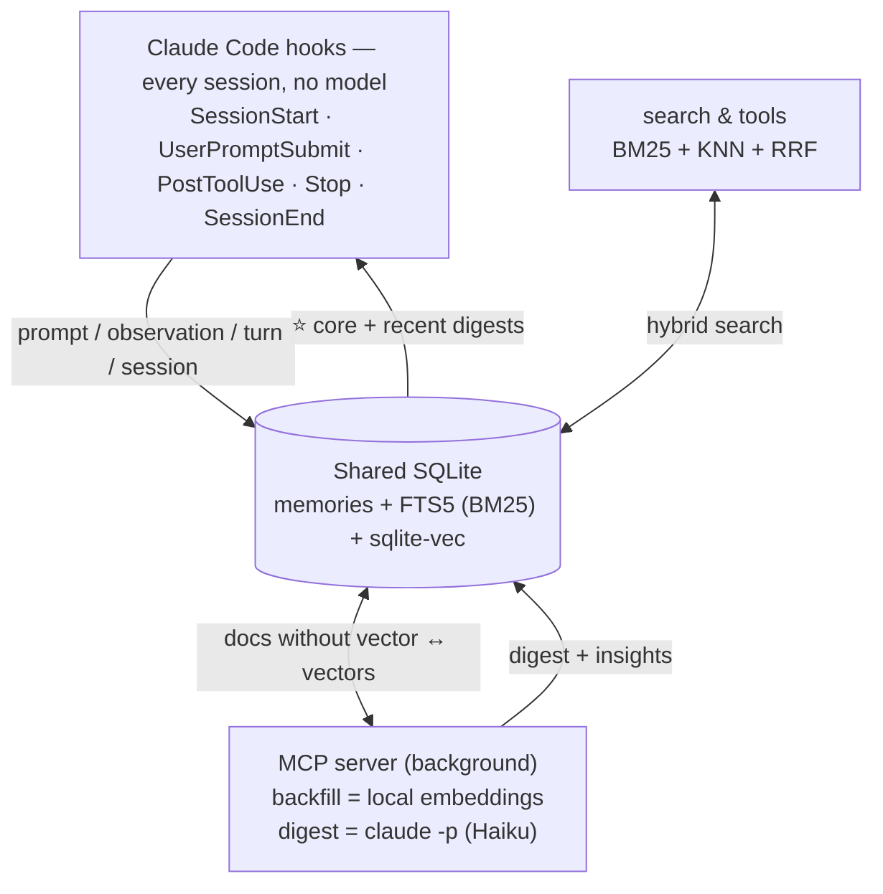
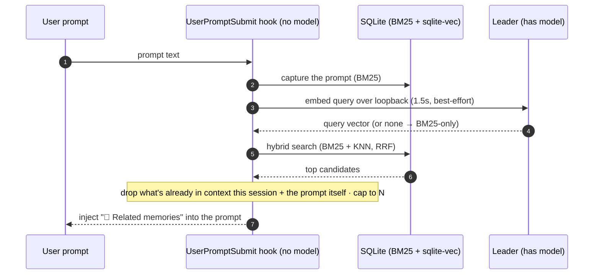
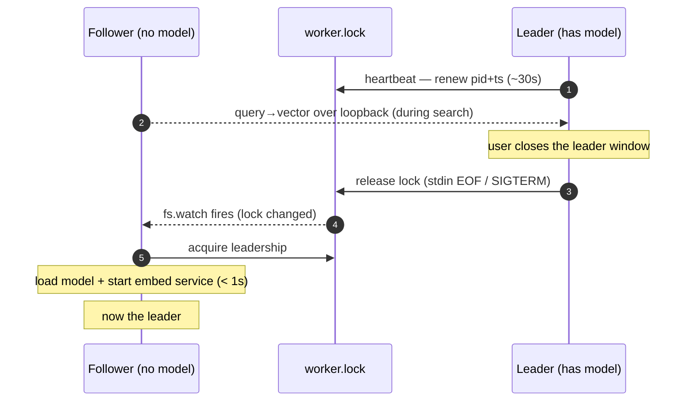

<div align="center">


### Persistent memory for Claude Code — **local SQLite**, **hybrid BM25 + semantic** search.

A lightweight alternative to claude-mem: **embedded database, local embeddings, zero server, zero daemon, zero cloud.** The hooks never block Claude Code.

[](./.claude-plugin/plugin.json)
[](https://docs.claude.com/en/docs/claude-code)
[](https://nodejs.org)
[](./LICENSE)
[](https://github.com/yoannyviquel/marketplace)

```sh
/plugin marketplace add yoannyviquel/marketplace
/plugin install memory
```

</div>

---

> **Capture and search are 100% local** (no cloud). The only optional cloud step is the **LLM session digest**: it compresses each session into typed conclusions via your **existing Claude Code auth** (`claude -p`, no API key). Disable it any time with `MEMORY_DIGEST_ENABLED=0`.

## ✨ Features

| | Feature | What it gives you |
|---|---|---|
| 🗄️ | **Embedded SQLite** | A library + a file, opened in-process. No server, no daemon, no fragile Chroma/uvx stack. |
| 🔎 | **Hybrid search** | BM25 (FTS5) for exact identifiers **+** local semantic embeddings (sqlite-vec), fused with Reciprocal Rank Fusion. |
| 🎯 | **Cross-encoder reranking** | Two-stage retrieval (recall → rerank) for precision that a bigger embedder can't buy on a small base. |
| 🪝 | **Automatic capture** | Hooks record prompts, tool observations, turns and sessions with **no model loaded** — instant and BM25-searchable. |
| 🧠 | **Auto-recall** | Relevant memories are injected **systematically** at `SessionStart` and on **every prompt** — not left to the model deciding to search. |
| ⭐ | **Core memories** | Primordial facts injected into every session; created on demand or proposed when a fact recurs. |
| 📚 | **Ingested docs** | Feed a Confluence page, README or spec into memory (pointer or full chunked body) and search it offline. |
| 🌍 | **Multilingual tiers** | e5 small / base / large, q8-quantized, switchable live — with optional GPU acceleration. |
| 🤝 | **Leader failover** | Across N open sessions, one server holds the single loaded model; the rest route just their query vector → **one model in RAM total**. |
| 🛡️ | **Never blocks** | Locked DB, missing model, no sqlite-vec → graceful degrade to BM25. Claude Code is never held up. |

## 🧠 In action

Recall is automatic — but you can also search on demand:

```text
> /memory:search kafka consumer stop

🧠 3 memories (hybrid BM25 + semantic, reranked)  😀 pleased
 1. [project] offer-replication-rules consumer stops on topic policyrequests… → re-auth OAuth
 2. [digest] Diagnosed via Prometheus metrics; prod masks INFO/WARNING logs
 3. [doc]     CIO — Chaîne d'intégration offre (Confluence, indexed)
```

<!-- TODO: replace the block above with a real screenshot/GIF of /memory:search and SessionStart auto-recall -->
<!-- <p align="center"></p> -->

## 🚀 Install

### From the marketplace (recommended)

The plugin ships with its build artifacts committed (`dist/`), so **no `npm install` / build is needed** — add the marketplace and install:

```text
/plugin marketplace add yoannyviquel/marketplace
/plugin install memory
```

Restart Claude Code (or `/reload-plugins`) to activate the hooks + MCP server.

> The `yoannyviquel/marketplace` catalogue references this plugin by its own GitHub repo (`github.com/yoannyviquel/memory`, ref `main`); each plugin updates independently of the catalogue.

<details>
<summary><b>From source (local development)</b></summary>

```bash
cd memory
npm install
npm run build      # -> dist/server.js, dist/hook.js, dist/migrate.js, dist/vec0.dll
```

Then add the local checkout as a marketplace and install:

```text
/plugin marketplace add C:/tfs/yoannyviquel/memory
/plugin install memory
```

Restart Claude Code (or `/reload-plugins`) to activate hooks + MCP server.

</details>

### Requirements

- **Node ≥ 22.5** (`node:sqlite` module + FTS5 + extension loading). Launched via `node --no-warnings`.
- Semantic search works without installing anything else (transformers.js + onnxruntime-node prebuilt via `npm install`; model downloaded on first use). Can be disabled with `MEMORY_EMBED_ENABLED=0`.

## 🧩 What it does

- **Automatic capture** via hooks (same events as claude-mem):
  - `SessionStart` → **injects** the project's core memories + recent digests into the context.
  - `UserPromptSubmit` → indexes the user prompt **and injects** the top relevant memories (auto-recall).
  - `PostToolUse` → indexes one observation per tool call (tool, touched files).
  - `Stop` → indexes the assistant turn (text, tools, files).
  - `SessionEnd` → indexes a session summary.
- **LLM digests** (background, opt-out): the MCP server compresses each finished session into a `digest` (1–3 sentence conclusion) + typed `insight` docs (`decision` / `bugfix` / `discovery` / `conclusion`). These high-signal docs are what `SessionStart` injects and what ranks best in search; raw turns stay as the recall safety net.
- **Core memories**: primordial facts injected into **every** session at load. Created explicitly, or **proposed by Claude** when a fact recurs (`memory_core_suggest`). Tools: `memory_core_add` / `memory_core_list` / `memory_core_remove` / `memory_core_suggest`, or `/memory:core`. Global by default, or project-scoped.
- **Ingested docs** (curated knowledge): feed external documentation into memory so it becomes searchable. The plugin does **no network access** — Claude fetches the content and passes it to `memory_doc_add`. **Tier 1** (pointer: title + URL + summary) and **Tier 2** (full body → vectorized chunks). Idempotent per URL. Tools: `memory_doc_add` / `memory_doc_list` / `memory_doc_remove`. Filter searches with `type: doc`.
- **Search** via MCP: `memory_search` (hybrid), `memory_recent`, `memory_stats`.
- **Reindex** via MCP `memory_reindex` (or `/memory:reindex`): rebuild vectors and/or regenerate digests.
- **Migration** of claude-mem history (SQLite) → memory database.

## 📋 Commands

- `/memory:search <text>` — hybrid search.
- `/memory:status` — database + vector index + embedder state + backfill lag.
- `/memory:config <light|medium|heavy>` — change the embedding model tier.
- `/memory:core [list|suggest|remove <id>|<text>]` — manage core memories (always injected at load).
- `/memory:reindex [vectors|digests|all]` — force re-vectorization and/or re-digest (background).
- `/memory:delete <idPrefix|project=…|type=…>` — delete memories by filter (destructive, confirms first).
- `/memory:migrate` — claude-mem migration.

---

<details>
<summary><h2>🔬 How it works</h2></summary>



- **Hooks** (every session) capture raw memories with **no model loaded** → instant, BM25-searchable immediately. `SessionStart` injects **core memories + recent digests** into the new session.
- The **MCP server** does the heavy work in the background: vectorizes pending docs (*backfill*), and compresses finished sessions into LLM **digests** (Haiku).
- Across several open sessions, **one server is elected leader** (it holds the single loaded model); the others route their query embedding to it.

### Auto-recall (systematic memory injection)

Recall is **automatic** — it is **not** left to the model deciding to call `memory_search`. Memories reach the context through two injection paths:

- **At `SessionStart`** — core memories + recent digests for the project (the session's starting context).
- **On every prompt** (`UserPromptSubmit`) — the hook searches the prompt just typed and injects the top relevant memories inline, so the answer is grounded in past work even on the first turn.

The per-prompt recall is **hybrid**: the ephemeral hook embeds the *query* via the leader's loopback service (it loads no model itself), falling back to BM25 if no leader is reachable.



**On by default**; disable with `MEMORY_AUTO_RECALL=0`, cap with `MEMORY_AUTO_RECALL_LIMIT` (default 3).

**Anti-bloat** — the injected context can't snowball over a long session:

- **Dedup per session** — a memory is injected **at most once** (the set includes what `SessionStart` already showed), tracked in the session state file.
- **Bounded** — at most `MEMORY_AUTO_RECALL_LIMIT` *new* memories per prompt (default 3), each a single compact line.
- **Gated** — trivial prompts (< 24 chars: "ok", "yes"…) skip recall entirely.

So most turns inject **0** (nothing new or relevant), and a given memory never repeats.

> **Single memory backend.** To make this plugin the *only* persistent memory — instead of Claude Code's built-in `.md` file memory — add a memory-policy block to your global `~/.claude/CLAUDE.md` instructing Claude to save durable facts via `memory_core_add` (and **not** write `.md` memory files or a `MEMORY.md`). The plugin reinforces this with a `SessionStart` reminder. The CLAUDE.md instruction is what reliably overrides the built-in file memory — the plugin can't disable it on its own.

### Why SQLite (embedded, no server)

SQLite is an **embedded** database: a library + a file opened in-process. No server to install or start, no external dependency (like the Chroma/uvx stack that made claude-mem fragile). FTS5 (BM25) and the vector index (sqlite-vec) are loaded in-process inside Node's SQLite, and embeddings are computed locally by transformers.js — nothing to run alongside.

</details>

<details>
<summary><h2>🔎 Search internals — BM25 + semantic + reranking</h2></summary>

- **BM25 (FTS5)**: lexical, always on, zero dependency. Excellent on exact identifiers (files, errors, commands).
- **Semantic**: embeddings computed locally (**transformers.js**, ONNX model) and stored in **sqlite-vec**. Finds by meaning (synonyms, paraphrase) even without a common word. The model is downloaded once (local cache) on first use.
- The two rankings are fused (**Reciprocal Rank Fusion**).
- **Reranker (optional, on by default)**: a cross-encoder reorders the top candidates for precision.
- **If the embedder is unavailable → BM25-only search, no error.**

### Reranking (two-stage retrieval)

Bigger embedders give little on a small personal base; the real precision win is a **cross-encoder reranker**. Search is two-stage:

1. **Recall** — hybrid BM25 + vector KNN (RRF) over a **bounded** candidate set `K = clamp(limit×5, 50, 100)`. Cheap and index-backed, so it scales to any base size.
2. **Rerank** — a cross-encoder scores each `(query, candidate)` pair and reorders; the top `limit` are returned.

K is **bounded on purpose** (not a % of the corpus): a cross-encoder costs O(candidates), so a percentage would get slower as the base grows.

| Tier | Reranker |
|---|---|
| `light` | none (recall only) |
| `medium` | `Xenova/bge-reranker-base` |
| `heavy` | `onnx-community/bge-reranker-v2-m3-ONNX` |

The reranker is a **second model**, loaded **lazily on the leader** (only when a search actually reranks), reused by followers via the same loopback service. If unavailable → the RRF order is kept, never an error. Disable with `MEMORY_RERANK_ENABLED=0`; override with `MEMORY_RERANK_MODEL`.

### Satisfaction weighting (mood-aware ranking)

When the LLM digests a session it also rates, from **the user's tone alone**, how satisfied they seemed — `satisfaction` ∈ [0, 1] plus a one/two-word `mood` — and stores both on the `digest`/`insight` docs. At search time this becomes a **bounded relevance multiplier** `1 + w·(2·satisfaction − 1)` ∈ `[1−w, 1+w]` (`w` = `MEMORY_SATISFACTION_WEIGHT`, default `0.12`):

- **The more a memory pleased the user, the more weight it carries.** At (near-)equal relevance the most satisfying memory ranks first; a clearly more relevant memory still wins (it's a tie-breaker).
- Applied **everywhere** retrieval happens: hybrid/BM25 recall, the reranker's final sort, and per-prompt auto-recall.
- **Neutral on missing signal**: docs without a satisfaction score get factor `1`. Disable with `MEMORY_SATISFACTION_WEIGHT=0`.

`memory_search` surfaces the mood inline (😀 / 😐 / 🙁 + the mood word).

</details>

<details>
<summary><h2>⚙️ Embeddings, model tiers & GPU</h2></summary>

### Embeddings architecture

The **hooks are ephemeral processes**: loading a model on every hook would be too slow. So the hooks **capture without vectorizing** (immediate BM25). It's the **persistent MCP server** that, in the background (at startup then every 60 s), vectorizes the pending documents (*backfill*) — the model is loaded only once, in that process. Observations (tool calls, mostly identifiers) are not vectorized: BM25 is enough.

### Leader failover (shared model)

Each open Claude Code session spawns its own MCP server (stdio transport). To avoid N servers each loading the model and running redundant loops, the servers elect a single **leader** via a lock file (`<dataDir>/worker.lock`, pid + heartbeat). Only the leader loads the model, runs backfill/digest, and exposes a **loopback embedding service** (`127.0.0.1` + token). Followers run BM25 + KNN locally and route just the **query→vector** step to the leader → **one model in RAM total**.



Heartbeat is the fallback; a **hard kill** is recovered within `STALE_MS` ≈ 90 s. While no leader is reachable, search degrades to BM25-only — never an error.

### Model tiers (multilingual)

Three multilingual tiers (e5 family), via `/memory:config <tier>` or `~/.claude-memory/config.json` (`{"embedTier":"medium"}`):

| Tier | Model | Dim | Size (q8) | Use |
|---|---|---|---|---|
| `light` (default) | `Xenova/multilingual-e5-small` | 384 | ~120 MB | fast, low resource |
| `medium` | `Xenova/multilingual-e5-base` | 768 | ~280 MB | best trade-off (recommended) |
| `heavy` | `Xenova/multilingual-e5-large` | 1024 | ~560 MB | high quality |

For a personal, hybrid-with-BM25 base, **medium** is the sweet spot — precision is better gained with a **reranker** than a bigger embedder. Models load in **q8 (quantized)** by default (~4× lighter download, negligible quality loss); force full precision with `MEMORY_EMBED_DTYPE=fp32`. **Changing tier is safe**: old vectors are cleared and re-vectorized in the background; documents stay searchable via BM25 meanwhile.

### RAM profile (model-load transient)

Loading the embedding model briefly spikes RAM, then settles. On the **heavy** tier the leader jumps to **~2 GB for a few seconds, then drops to ~600 MB**. This is ONNX Runtime session creation (`graphOptimizationLevel: 'all'` builds an optimized copy while the original is still in memory), not a leak. It happens **once** per model load. To shrink it: use a lighter tier.

### GPU acceleration (opt-in)

Vectorization runs on **CPU by default**. To use the GPU, set `MEMORY_EMBED_DEVICE` — the embedder **and** reranker then run on it (leader only):

| Platform | `MEMORY_EMBED_DEVICE` | Provider | Needs |
|---|---|---|---|
| Windows (any DX12 GPU, incl. iGPU) | `dml` | DirectML | a DX12 GPU |
| macOS Apple Silicon (M1–M4) | `coreml` | CoreML (ANE/GPU) | macOS ≥ 10.15 |
| Linux + NVIDIA | `cuda` | CUDA | NVIDIA GPU + driver |
| any (experimental) | `webgpu` | WebGPU (Dawn) | — |
| — (default) | unset / `cpu` | CPU | — |

`auto` picks the platform's GPU EP. **The speedup is very hardware-dependent — benchmark before adopting** (`/memory:status` shows the effective `device=`). A device that loads but can't run falls back to **CPU/fp32** — logged, never a crash.

</details>

<details>
<summary><h2>🎛️ Configuration</h2></summary>

Two mechanisms, **env takes precedence over the file**:
- File `~/.claude-memory/config.json`, e.g. `{ "embedTier": "medium" }` (keys: `embedTier`, `embedEnabled`, `embedDevice`, `digestEnabled`, `digestModel`, `rerankEnabled`, `rerankModel`, `autoRecall`, `autoRecallLimit`, `satisfactionWeight`, `loadPercent`, `dbPath`, `embedModel`, `embedDim`, `contextLimit`). Editable via `/memory:config`.
- System environment variables (overrides):

| Variable | Default | Role |
|---|---|---|
| `MEMORY_EMBED_TIER` | `light` | Model tier: `light` / `medium` / `heavy` |
| `MEMORY_DB_PATH` | `~/.claude-memory/memories.db` | Memories SQLite file |
| `MEMORY_DATA_DIR` | `~/.claude-memory` | Folder (db + cursors + model cache + config.json) |
| `MEMORY_CONTEXT_LIMIT` | `10` | Memories injected at `SessionStart` |
| `MEMORY_EMBED_ENABLED` | _(enabled)_ | `0` to disable semantic search (BM25 only) |
| `MEMORY_DIGEST_ENABLED` | _(enabled)_ | `0` to disable LLM session digests (`claude -p`) |
| `MEMORY_DIGEST_MODEL` | `haiku` | Model for digests (`haiku` / `sonnet` / `opus` / pinned id) |
| `MEMORY_RERANK_ENABLED` | _(enabled)_ | `0` to disable the cross-encoder reranker |
| `MEMORY_RERANK_MODEL` | _(per tier)_ | Override the reranker model (empty = none) |
| `MEMORY_AUTO_RECALL` | _(enabled)_ | `0` to disable per-prompt auto-recall injection |
| `MEMORY_AUTO_RECALL_LIMIT` | `3` | Max new memories injected per prompt |
| `MEMORY_SATISFACTION_WEIGHT` | `0.12` | Satisfaction ranking strength (±factor); `0` to disable |
| `MEMORY_LOAD_PERCENT` | `100` | Cap background work (vectorization + digests) to this % of CPU/GPU |
| `MEMORY_EMBED_MODEL` | _(per tier)_ | Force a specific model (overrides the tier) |
| `MEMORY_EMBED_DIM` | _(per tier)_ | Force the dimension (must match the model) |
| `MEMORY_EMBED_DTYPE` | `q8` (cpu) / `fp32` (gpu) | ONNX precision: `q8` or `fp32` |
| `MEMORY_EMBED_DEVICE` | _(cpu)_ | GPU opt-in: `dml` / `coreml` / `cuda` / `webgpu` / `auto` |
| `MEMORY_EMBED_CACHE_DIR` | `~/.claude-memory/models` | ONNX model cache |
| `MEMORY_VEC_EXTENSION` | _(auto)_ | Explicit path to the sqlite-vec library |

> The plugin requires **no** config at install time.

### LLM digests — cost & isolation

- **Model & cost**: **Haiku by default** (the `haiku` alias resolves the current Haiku version). Override with `MEMORY_DIGEST_MODEL`. It reuses your existing Claude Code auth, so on a **Claude Max/Pro subscription this is no extra money** — it consumes your **plan usage quota** (5-hour / weekly limits). The first run digests all past sessions (drip-limited). Set `MEMORY_DIGEST_ENABLED=0` to turn digests off.
- **Isolation**: the digest runs `claude -p --setting-sources "" --strict-mcp-config --disable-slash-commands` so **no hooks, plugins, skills or MCP servers load** in that child. A `MEMORY_HOOK_DISABLE=1` env on the child is an extra re-entrance guard.
- **Requirements**: a native `claude` binary on `PATH`. If only the npm `.cmd` shim exists, digests degrade off (logged once); raw memory keeps working.
- **Reprocessing**: version markers in the `meta` table (`digest_version`, `embed_text_version`) drive automatic re-digest / re-vectorization — no manual migration. Drip-limited (3/tick).

### Resource use & throttling

Background work (vectorization + digests) runs only on the leader, drip-limited and best-effort. `loadPercent` (env `MEMORY_LOAD_PERCENT` / file `loadPercent`, default `100`) caps the **duty cycle** of the background loops:

```
pause = work_time · (100 / loadPercent − 1)      # 100 → full speed, 50 → ~half, 30 → ~third
```

Unlike an ONNX thread cap, this caps the *average* load and is **device-agnostic** (throttles a GPU run too). Set it live with `/memory:load <percent>` then `/reload-plugins`. `memory_stats` reports the current cap and indexing backlog.

</details>

<details>
<summary><h2>🗃️ Schema & migration from claude-mem</h2></summary>

### Schema

Table `memories` (7 `type`s: `observation`, `prompt`, `turn`, `session`, `digest`, `insight`, `core`) + FTS5 `memories_fts` (sync triggers) + `vec_memories` (sqlite-vec). Deterministic `mem_id` → idempotent upsert (`ON CONFLICT`). `digest`/`insight` store their kind/version in `source`, plus `satisfaction` (REAL, 0..1) + `mood` (TEXT). A `meta` table holds version markers (`embed_model`, `embed_dim`, `embed_text_version`, `digest_version`). WAL mode for concurrent hook/server access.

### Migration from claude-mem

```bash
node --no-warnings dist/migrate.js --dry-run            # counts without writing
node --no-warnings dist/migrate.js                      # imports (BM25; vectors done by the server afterwards)
node --no-warnings dist/migrate.js --embed              # imports + vectorizes right away (local model)
```

Options: `--db <path>` (default `~/.claude-mem/claude-mem.db`), `--project <name>`, `--batch <n>`, `--embed`. Read-only on the claude-mem database. Migrated docs prefixed `migrated:` → re-runnable without duplicates.

**Maps straight to the digest format (no LLM, no quota)**: `observations → insight` docs, `session_summaries → digest` docs, `user_prompts → prompt`. Migrated content shows up like native digests without any `claude -p` call. To re-import cleanly after upgrading: `/memory:delete migrated:` then re-run. Or via `/memory:migrate`.

</details>

<details>
<summary><h2>🩺 Diagnostics & robustness</h2></summary>

### Diagnostics & status line

- **Logs**: `~/.claude-memory/logs/memory.log` (1 MB rotation). At startup: version, node, database, model, `dtype`, vector state, model presence. A model download is traced (`[embed] download model.onnx 40%…`).
- **Current state**: the server writes `~/.claude-memory/status.json` (`idle` / `loading` / `downloading` / `backfilling` / `digesting`), also readable via `memory_stats`.
- **Presence reminder (opt-in)**: a ready-to-use snippet is generated in `~/.claude-memory/statusline.mjs`. To show the plugin is active, add to `settings.json`:

  ```json
  { "statusLine": { "type": "command", "command": "node ~/.claude-memory/statusline.mjs" } }
  ```

  The bar shows `🧠 mem` when idle, `🧠 mem ⚙` during indexing, `🧠 mem ⏳x%` during a download.

### Robustness

If anything fails (locked database, unavailable model, missing sqlite-vec), everything degrades gracefully: hooks output `{"continue":true,"suppressOutput":true}` (exit 0), search falls back to BM25, the backfill retries. Claude Code is never blocked. And **no native compilation**: sqlite-vec and onnxruntime-node ship as prebuilt binaries.

</details>

---

<div align="center">

MIT © yoannyviquel · Part of the [**yoannyviquel** marketplace](https://github.com/yoannyviquel/marketplace)

</div>
