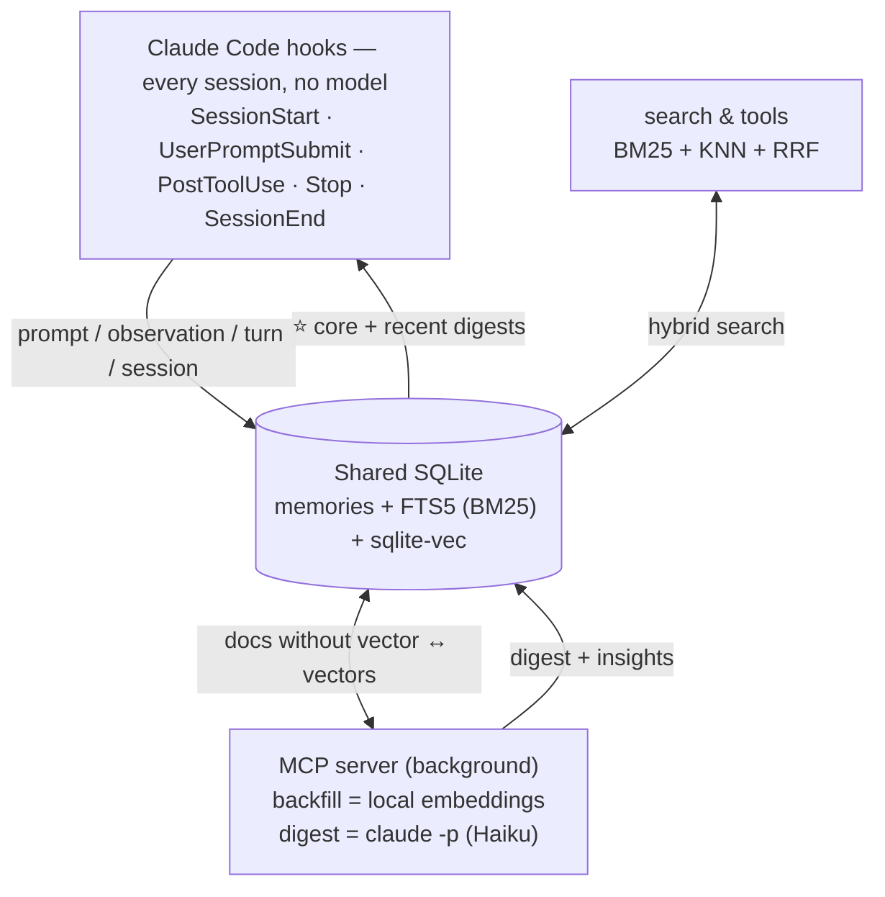
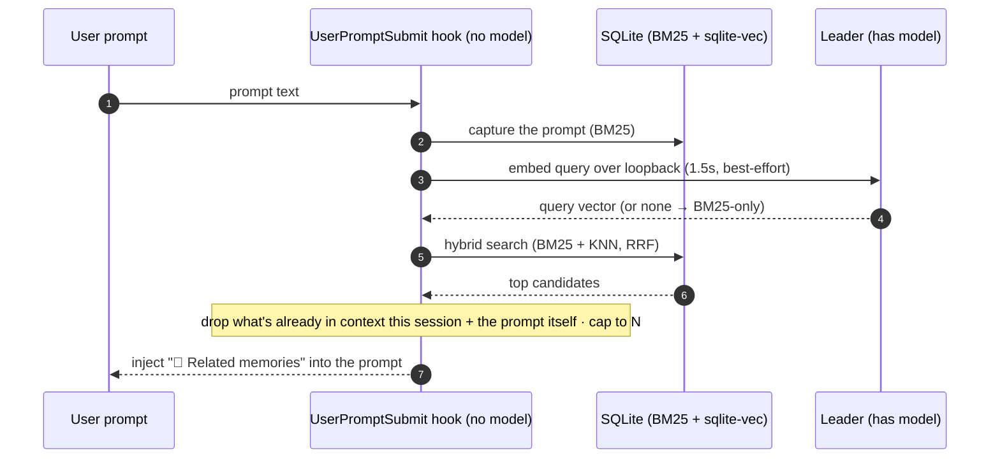
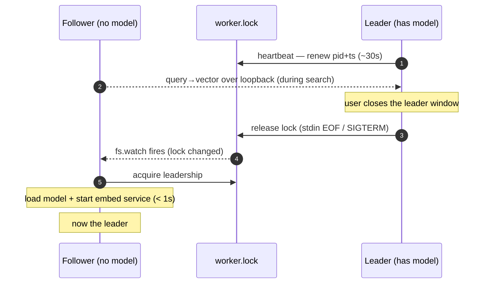
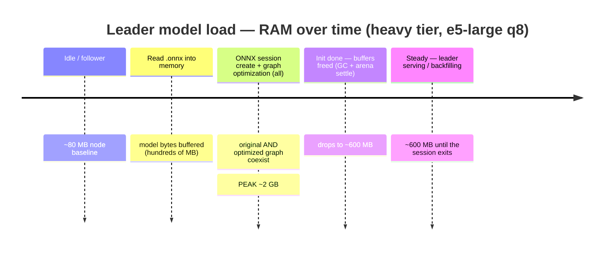

# memory

Persistent memory for Claude Code, stored in **local SQLite**, with **hybrid BM25 +
semantic** search. A lightweight alternative to claude-mem: **embedded database, local
embeddings, zero server, zero daemon**. The hooks never block Claude Code.

Capture and search are **fully local** (no cloud). The only optional cloud step is the
**LLM session digest** (see below): it compresses each session into typed conclusions via your
**existing Claude Code auth** (`claude -p`, no API key). It can be disabled (`MEMORY_DIGEST_ENABLED=0`).

## How it works



- **Hooks** (every session) capture raw memories with **no model loaded** → instant, BM25-searchable
  immediately. `SessionStart` injects **core memories + recent digests** into the new session.
- The **MCP server** does the heavy work in the background: vectorizes pending docs (*backfill*),
  and compresses finished sessions into LLM **digests** (Haiku).
- Across several open sessions, **one server is elected leader** (it holds the single loaded model);
  the others route their query embedding to it. See [Leader failover](#leader-failover-shared-model).

### Auto-recall (systematic memory injection)

Recall is **automatic** — it is **not** left to the model deciding to call `memory_search`. Memories
reach the context through two injection paths:

- **At `SessionStart`** — core memories + recent digests for the project (the session's starting context).
- **On every prompt** (`UserPromptSubmit`) — the hook searches the prompt just typed and injects the
  top relevant memories inline, so the answer is grounded in past work even on the first turn.

The per-prompt recall is **hybrid**: the ephemeral hook embeds the *query* via the leader's loopback
service (it loads no model itself), falling back to BM25 if no leader is reachable.



**On by default**; disable with `MEMORY_AUTO_RECALL=0`, cap with `MEMORY_AUTO_RECALL_LIMIT` (default 3).

**Anti-bloat** — the injected context can't snowball over a long session:

- **Dedup per session** — a memory is injected **at most once** (the set includes what `SessionStart`
  already showed), tracked in the session state file.
- **Bounded** — at most `MEMORY_AUTO_RECALL_LIMIT` *new* memories per prompt (default 3), each a single
  compact line.
- **Gated** — trivial prompts (< 24 chars: "ok", "yes"…) skip recall entirely.

So most turns inject **0** (nothing new or relevant), and a given memory never repeats.

> **Single memory backend.** To make this plugin the *only* persistent memory — instead of Claude
> Code's built-in `.md` file memory — add a memory-policy block to your global `~/.claude/CLAUDE.md`
> instructing Claude to save durable facts via `memory_core_add` (and **not** write `.md` memory files
> or a `MEMORY.md`). The plugin reinforces this with a `SessionStart` reminder. Explicit "remember
> this" → `memory_core_add` (always-injected core memory); ordinary work is captured automatically by
> the hooks. The CLAUDE.md instruction is what reliably overrides the built-in file memory — the
> plugin can't disable it on its own.

## Why SQLite (embedded, no server)

SQLite is an **embedded** database: a library + a file opened in-process. No server to install or
start, no external dependency (like the Chroma/uvx stack that made claude-mem fragile). FTS5 (BM25)
and the vector index (sqlite-vec) are loaded in-process inside Node's SQLite, and embeddings are
computed locally by transformers.js — nothing to run alongside.

## Search: BM25 + semantic (hybrid)

- **BM25 (FTS5)**: lexical, always on, zero dependency. Excellent on exact identifiers
  (files, errors, commands).
- **Semantic**: embeddings computed locally (**transformers.js**, ONNX model) and stored in
  **sqlite-vec**. Finds by meaning (synonyms, paraphrase) even without a common word. The model is
  downloaded once (local cache) on first use.
- The two rankings are fused (**Reciprocal Rank Fusion**).
- **Reranker (optional, on by default)**: a cross-encoder reorders the top candidates for precision
  (see below).
- **If the embedder is unavailable → BM25-only search, no error.**

### Reranking (two-stage retrieval)

Bigger embedders give little on a small personal base; the real precision win is a **cross-encoder
reranker**. Search is two-stage:

1. **Recall** — hybrid BM25 + vector KNN (RRF) over a **bounded** candidate set
   `K = clamp(limit×5, 50, 100)`. This stage is cheap and index-backed, so it scales to any base size.
2. **Rerank** — a cross-encoder scores each `(query, candidate)` pair and reorders; the top `limit`
   are returned.

K is **bounded on purpose** (not a % of the corpus): a cross-encoder costs O(candidates), so a
percentage would get slower as the base grows. The recall stage already surfaces the right
candidates regardless of size — the reranker just needs a fixed window to reorder.

Per tier (on by default; `MEMORY_RERANK_ENABLED=0` to disable, `MEMORY_RERANK_MODEL` to override):

| Tier | Reranker |
|---|---|
| `light` | none (recall only) |
| `medium` | `Xenova/bge-reranker-base` |
| `heavy` | `onnx-community/bge-reranker-v2-m3-ONNX` |

The reranker is a **second model**, loaded **lazily on the leader** (only when a search actually
reranks), reused by followers via the same loopback service. If unavailable → the RRF order is kept,
never an error.

### Satisfaction weighting (mood-aware ranking)

When the LLM digests a session it also rates, from **the user's tone alone**, how satisfied they
seemed — `satisfaction` ∈ [0, 1] (0 = frustrated, 0.5 = neutral, 1 = pleased) plus a one/two-word
`mood` — and stores both on the `digest`/`insight` docs. At search time this becomes a **bounded
relevance multiplier** `1 + w·(2·satisfaction − 1)` ∈ `[1−w, 1+w]` (`w` = `MEMORY_SATISFACTION_WEIGHT`,
default `0.12`):

- **The more a memory pleased the user, the more weight it carries.** At (near-)equal relevance the
  most satisfying memory ranks first; a clearly more relevant memory still wins (it's a tie-breaker,
  not an override).
- Applied **everywhere** retrieval happens: the hybrid/BM25 recall stage, the reranker's final sort,
  and per-prompt auto-recall — all share the same factor.
- **Neutral on missing signal**: docs without a satisfaction score (raw prompts/turns, pre-upgrade
  memories) get factor `1`, so they're never penalised. Disable entirely with
  `MEMORY_SATISFACTION_WEIGHT=0`.

`memory_search` surfaces the mood inline (😀 / 😐 / 🙁 + the mood word). Bumping `DIGEST_VERSION`
re-digests existing sessions so they pick up the new fields.

### Embeddings architecture (important)

The **hooks are ephemeral processes**: loading a model on every hook would be too slow. So the
hooks **capture without vectorizing** (immediate BM25). It's the **persistent MCP server** that,
in the background (at startup then every 60 s), vectorizes the pending documents (*backfill*) —
the model is loaded only once, in that process. Observations (tool calls, mostly identifiers)
are not vectorized: BM25 is enough for them.

### Leader failover (shared model)

Each open Claude Code session spawns its own MCP server (stdio transport). To avoid N servers each
loading the model (~hundreds of MB) and each running redundant backfill/digest loops (which would
multiply the digest quota cost), the servers elect a single **leader** via a lock file
(`<dataDir>/worker.lock`, pid + heartbeat). Only the leader loads the model, runs backfill/digest,
and exposes a **loopback embedding service** (`127.0.0.1` + token). Followers run BM25 + KNN locally
on the shared DB and route just the **query→vector** step to the leader → **one model in RAM total**.

Handoff when the leader's session closes:



Heartbeat is the fallback; a **hard kill** (no clean release) is recovered within `STALE_MS` ≈ 90 s.
While no leader is reachable, search degrades to BM25-only — never an error.

### RAM profile (model-load transient)

Loading the embedding model briefly spikes RAM, then settles. On the **heavy** tier you'll see the
leader jump to **~2 GB for a few seconds, then drop to ~600 MB** and stay there. This is normal —
it's ONNX Runtime session creation, not a leak:



The peak comes from `graphOptimizationLevel: 'all'`: ORT builds an optimized copy of the graph while
the original is still in memory, so peak ≈ ~2× the model. It happens **once** per model load (leader
startup or failover), not on every search. To shrink it: use a lighter tier (smaller model → lower
peak *and* steady), which is the only lever that affects both.

### Model tiers (multilingual)

Three multilingual tiers (e5 family), via `/memory:config <tier>` or the
`~/.claude-memory/config.json` file (`{"embedTier":"medium"}`):

| Tier | Model | Dim | Pooling | Size (q8) | Use |
|---|---|---|---|---|---|
| `light` (default) | `Xenova/multilingual-e5-small` | 384 | mean | ~120 MB | fast, low resource |
| `medium` | `Xenova/multilingual-e5-base` | 768 | mean | ~280 MB | best trade-off (recommended) |
| `heavy` | `Xenova/multilingual-e5-large` | 1024 | mean | ~560 MB | high quality |

For a personal, hybrid-with-BM25 memory base, **medium** is the sweet spot — a heavier bi-encoder
brings little on a small corpus. Precision is better gained with a **reranker** than a bigger embedder.

Models are loaded in **q8 (quantized)** by default: ~4× lighter to download than fp32, for a
negligible quality loss in semantic search. Force full precision:
`MEMORY_EMBED_DTYPE=fp32`.

**Changing tier is safe**: since the model/dimension changes, the old vectors are automatically
cleared (detected via a `meta` table) and **re-vectorized in the background**; documents stay
searchable via BM25 in the meantime. Advanced override: env `MEMORY_EMBED_MODEL` +
`MEMORY_EMBED_DIM`.

### GPU acceleration (opt-in)

Vectorization runs on **CPU by default**. To use the GPU, set `MEMORY_EMBED_DEVICE` — the embedder
**and** reranker then run on it (leader only). `onnxruntime-node` bundles the execution providers, so
no extra toolkit is needed (except an NVIDIA GPU for CUDA):

| Platform | `MEMORY_EMBED_DEVICE` | Provider | Needs |
|---|---|---|---|
| Windows (any DX12 GPU, incl. iGPU) | `dml` | DirectML | a DX12 GPU |
| macOS Apple Silicon (M1–M4) | `coreml` | CoreML (ANE/GPU) | macOS ≥ 10.15 |
| Linux + NVIDIA | `cuda` | CUDA | NVIDIA GPU + driver |
| any (experimental) | `webgpu` | WebGPU (Dawn) | — |
| — (default) | unset / `cpu` | CPU | — |

`auto` picks the platform's GPU EP (Windows→`dml`, macOS→`coreml`; else CPU). **The speedup is very
hardware-dependent — not guaranteed.** Measured on an integrated GPU (DirectML), e5-large was
break-even with CPU (~230/min both) and e5-small was *slower* on GPU: CPU `q8` (int8/AVX) is hard to
beat for small models, and GPU EPs run `fp32`. A strong discrete GPU (or CUDA on NVIDIA) is where it
pays off. **Benchmark before adopting** (`/memory:status` shows the effective `device=`; watch the
backfill rate). Notes:
- It's **opt-in**: the default stays CPU so the plugin installs and runs everywhere.
- On GPU the default precision switches to **fp32** (int8/`q8` is poorly supported by GPU EPs);
  override with `MEMORY_EMBED_DTYPE`.
- **Safe fallback**: a device that loads but can't run is caught at startup (a warmup inference) and
  the model falls back to **CPU/fp32** — logged, never a crash. `/memory:status` shows the effective
  `device=…`.
- CoreML op coverage is partial → some sub-graphs may run on CPU (less speedup).

## What it does

- **Automatic capture** via hooks (same events as claude-mem):
  - `SessionStart` → **injects** the project's core memories + recent digests into the context.
  - `UserPromptSubmit` → indexes the user prompt **and injects** the top relevant memories
    (auto-recall — see [Auto-recall](#auto-recall-systematic-memory-injection)).
  - `PostToolUse` → indexes one observation per tool call (tool, touched files).
  - `Stop` → indexes the assistant turn (text, tools, files).
  - `SessionEnd` → indexes a session summary.
- **LLM digests** (background, opt-out): the MCP server compresses each finished session into a
  `digest` (1–3 sentence conclusion) + typed `insight` docs (`decision` / `bugfix` / `discovery` /
  `conclusion`). These high-signal docs are what `SessionStart` injects and what ranks best in
  search; raw turns stay as the recall safety net. Model, cost & isolation:
  see [LLM digests — cost & isolation](#llm-digests--cost--isolation).
- **Core memories**: primordial facts injected into **every** session at load (above the digests).
  Created explicitly (the user asks to remember something), or **proposed by Claude** when a fact
  recurs across many memories (`memory_core_suggest` surfaces signals; the user must agree before it
  is saved). Tools: `memory_core_add` / `memory_core_list` / `memory_core_remove` / `memory_core_suggest`,
  or `/memory:core`. Global by default, or scoped to a project.
- **Search** via MCP: `memory_search` (hybrid), `memory_recent`, `memory_stats`.
- **Reindex** via MCP `memory_reindex` (or `/memory:reindex`): rebuild vectors and/or regenerate digests.
- **Migration** of claude-mem history (SQLite) → memory database.

### LLM digests — cost & isolation

- **Model & cost**: **Haiku by default** (the `haiku` alias → the CLI resolves the current Haiku
  version, so it's future-proof). Override with `MEMORY_DIGEST_MODEL` (env) / `digestModel` (file) —
  e.g. `sonnet`, `opus`, or a pinned id. It reuses your existing Claude Code auth, so on a **Claude
  Max/Pro subscription this is no extra money** — it consumes your **plan usage quota** (5-hour /
  weekly limits), in competition with your interactive coding. `total_cost_usd` in logs is a notional
  API-equivalent, not a charge. Haiku keeps that quota cost low; the background loop won't compete
  with your interactive Opus. The first run digests all past sessions (drip-limited to spread it).
  Set `MEMORY_DIGEST_ENABLED=0` to turn digests off.
- **Isolation**: the digest runs `claude -p --setting-sources "" --strict-mcp-config
  --disable-slash-commands` so **no hooks, plugins, skills or MCP servers load** in that child — it
  can't re-trigger this plugin's own hooks. (`--bare` is *not* used: it would skip keychain reads and
  break auth.) A `MEMORY_HOOK_DISABLE=1` env on the child is an extra re-entrance guard.
- **Requirements**: a native `claude` binary on `PATH` (or `~/.local/bin`). If only the npm `.cmd`
  shim exists, digests degrade off (logged once); raw memory keeps working.
- **Reprocessing**: version markers in the `meta` table (`digest_version`, `embed_text_version`)
  drive automatic re-digest / re-vectorization when the prompt or embed text changes — no manual
  migration. Existing sessions are digested retroactively, **drip-limited** (3/tick) to avoid a burst.

All hooks run with `suppressOutput` (no noise in the context), except `SessionStart` and
`UserPromptSubmit` (auto-recall), which emit `additionalContext`.

### Resource use & throttling

Background work (semantic **vectorization** + **LLM digests**) runs only on the leader, drip-limited
and best-effort. It's normally invisible — but it spikes briefly after an **update that re-processes
the history**: bumping `digest_version` re-digests every past session, and each new digest's text is
re-vectorized. That's a **one-time catch-up**; memory stays fully usable (BM25) the whole time.

To bound that load, `loadPercent` (env `MEMORY_LOAD_PERCENT` / file `loadPercent`, default `100`)
caps the **duty cycle** of the background loops — the share of wall-time they may keep the inference
device busy. After each batch/session they idle a proportional slice:

```
pause = work_time · (100 / loadPercent − 1)      # 100 → 0 (full speed), 50 → ~half, 30 → ~third
```

Unlike an ONNX thread cap (CPU-only, caps the *peak*), this caps the *average* load and is
**device-agnostic** — it throttles a GPU run too, which a thread cap can't. Set it live with
`/memory:load <percent>` then `/reload-plugins`. `memory_stats` reports the current cap and any
indexing backlog, so "why is memory busy?" has a clear, self-describing answer.

## Requirements

- **Node ≥ 22.5** (`node:sqlite` module + FTS5 + extension loading). Launched via `node --no-warnings`.
- Semantic search works without installing anything else (transformers.js + onnxruntime-node prebuilt
  via `npm install`; model downloaded on first use). Can be disabled with `MEMORY_EMBED_ENABLED=0`.

## Installation

### From the marketplace (recommended)

The plugin ships with its build artifacts committed (`dist/`), so **no `npm install` /
build is needed** — add the marketplace and install:

```
/plugin marketplace add yoannyviquel/marketplace
/plugin install memory
```

Restart Claude Code (or `/reload-plugins`) to activate the hooks + MCP server.

> The `yoannyviquel/marketplace` catalogue references this plugin by its own GitHub repo
> (`github.com/yoannyviquel/memory`, ref `main`); each plugin updates independently of the catalogue.

### From source (local development)

```bash
cd memory
npm install
npm run build      # -> dist/server.js, dist/hook.js, dist/migrate.js, dist/vec0.dll
```

Then add the local checkout as a marketplace and install:

```
/plugin marketplace add C:/tfs/yoannyviquel/memory
/plugin install memory
```

Restart Claude Code (or `/reload-plugins`) to activate hooks + MCP server.

## Configuration

Two mechanisms, **env takes precedence over the file**:
- File `~/.claude-memory/config.json`, e.g. `{ "embedTier": "medium" }` (keys: `embedTier`,
  `embedEnabled`, `embedDevice`, `digestEnabled`, `digestModel`, `rerankEnabled`, `rerankModel`, `autoRecall`, `autoRecallLimit`, `satisfactionWeight`, `loadPercent`, `dbPath`, `embedModel`, `embedDim`, `contextLimit`). Editable via `/memory:config`.
- System environment variables (overrides):

| Variable | Default | Role |
|---|---|---|
| `MEMORY_EMBED_TIER` | `light` | Model tier: `light` / `medium` / `heavy` (see above) |
| `MEMORY_DB_PATH` | `~/.claude-memory/memories.db` | Memories SQLite file |
| `MEMORY_DATA_DIR` | `~/.claude-memory` | Folder (db + cursors + model cache + config.json) |
| `MEMORY_CONTEXT_LIMIT` | `10` | Memories injected at `SessionStart` |
| `MEMORY_EMBED_ENABLED` | _(enabled)_ | `0` to disable semantic search (BM25 only) |
| `MEMORY_DIGEST_ENABLED` | _(enabled)_ | `0` to disable LLM session digests (`claude -p`) |
| `MEMORY_DIGEST_MODEL` | `haiku` | Model for digests (`haiku` / `sonnet` / `opus` / pinned id) |
| `MEMORY_RERANK_ENABLED` | _(enabled)_ | `0` to disable the cross-encoder reranker |
| `MEMORY_RERANK_MODEL` | _(per tier)_ | Override the reranker model (empty = none) |
| `MEMORY_AUTO_RECALL` | _(enabled)_ | `0` to disable per-prompt auto-recall injection |
| `MEMORY_AUTO_RECALL_LIMIT` | `3` | Max new memories injected per prompt (auto-recall) |
| `MEMORY_SATISFACTION_WEIGHT` | `0.12` | Satisfaction ranking strength (±factor); `0` to disable |
| `MEMORY_LOAD_PERCENT` | `100` | Cap background work (vectorization + digests) to this % of CPU/GPU |
| `MEMORY_EMBED_MODEL` | _(per tier)_ | Force a specific model (overrides the tier) |
| `MEMORY_EMBED_DIM` | _(per tier)_ | Force the dimension (must match the model) |
| `MEMORY_EMBED_DTYPE` | `q8` (cpu) / `fp32` (gpu) | ONNX precision: `q8` (quantized) or `fp32` |
| `MEMORY_EMBED_DEVICE` | _(cpu)_ | GPU opt-in: `dml` / `coreml` / `cuda` / `webgpu` / `auto` (see GPU section) |
| `MEMORY_EMBED_CACHE_DIR` | `~/.claude-memory/models` | ONNX model cache |
| `MEMORY_VEC_EXTENSION` | _(auto)_ | Explicit path to the sqlite-vec library |

> The plugin itself requires **no** config at install time. Changing model/tier is safe — see
> [Model tiers](#model-tiers-multilingual).

## Schema

Table `memories` (7 `type`s: `observation`, `prompt`, `turn`, `session`, `digest`, `insight`, `core`)
+ FTS5 `memories_fts` (sync triggers) + `vec_memories` (sqlite-vec). Deterministic `mem_id`
(`{session}:obs:{n}`, `…:prompt:{n}`, `…:turn:{n}`, `…:session`, `…:digest`, `…:insight:{i}`,
`core:{hash}`) → idempotent upsert (`ON CONFLICT`). `digest`/`insight` store their kind/version in `source`,
and their `satisfaction` (REAL, 0..1) + `mood` (TEXT) — added by a forward migration (`ALTER TABLE`) on
older DBs. A `meta` table holds version markers (`embed_model`, `embed_dim`, `embed_text_version`,
`digest_version`). WAL mode for concurrent hook/server access.

## Migration from claude-mem

```bash
node --no-warnings dist/migrate.js --dry-run            # counts without writing
node --no-warnings dist/migrate.js                      # imports (BM25; vectors done by the server afterwards)
node --no-warnings dist/migrate.js --embed              # imports + vectorizes right away (local model)
```

Options: `--db <path>` (default `~/.claude-mem/claude-mem.db`), `--project <name>`, `--batch <n>`,
`--embed`. Read-only on the claude-mem database. Migrated docs prefixed `migrated:` → re-runnable
without duplicates.

**Maps straight to the digest format (no LLM, no quota)**: claude-mem already stores typed,
compressed data, so `observations → insight` docs (kind from claude-mem's type) and
`session_summaries → digest` docs (conclusion from completed/learned/request); `user_prompts →
prompt`. Migrated content thus shows up like native digests (injected at SessionStart, ranks in
search) without any `claude -p` call.

To re-import cleanly after upgrading the format: `/memory:delete migrated:` then re-run the
migration. Without `--embed`, migrated docs are vectorized progressively by the backfill.

Or via the command: `/memory:migrate`.

## Commands

- `/memory:search <text>` — hybrid search.
- `/memory:status` — database + vector index + embedder state + backfill lag.
- `/memory:config <light|medium|heavy>` — change the embedding model tier.
- `/memory:core [list|suggest|remove <id>|<text>]` — manage core memories (always injected at load).
- `/memory:reindex [vectors|digests|all]` — force re-vectorization and/or re-digest (background).
- `/memory:delete <idPrefix|project=…|type=…>` — delete memories by filter (destructive, confirms first).
- `/memory:migrate` — claude-mem migration.

## Diagnostics & status line

- **Logs**: `~/.claude-memory/logs/memory.log` (1 MB rotation). At startup: version, node,
  database, model, `dtype`, vector state and whether the model is present on disk. A model
  download is traced (`[embed] download model.onnx 40%…`) — useful if a first use seems stuck.
- **Current state**: the server writes `~/.claude-memory/status.json`
  (`idle` / `loading` / `downloading` / `backfilling` / `digesting`) also readable via `memory_stats`.
- **Presence reminder (opt-in)**: a ready-to-use snippet is generated in
  `~/.claude-memory/statusline.mjs`. To permanently show that the plugin is active, add
  to `settings.json`:

  ```json
  { "statusLine": { "type": "command", "command": "node ~/.claude-memory/statusline.mjs" } }
  ```

  The bar shows `🧠 mem` when idle, `🧠 mem ⚙` during indexing, `🧠 mem ⏳x%` during a
  download (refreshed on conversation activity, not continuously).

## Robustness

If anything fails (locked database, unavailable model, missing sqlite-vec), everything degrades
gracefully: hooks output `{"continue":true,"suppressOutput":true}` (exit 0), search falls back
to BM25, the backfill retries. Claude Code is never blocked. And **no native compilation**:
sqlite-vec and onnxruntime-node ship as prebuilt binaries installed by npm.
</content>
</invoke>
