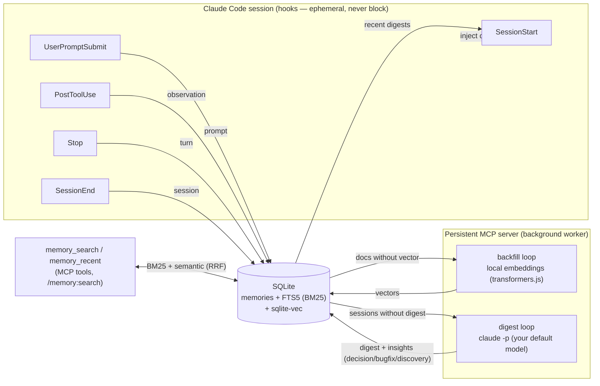

# memory

Persistent memory for Claude Code, stored in **local SQLite**, with **hybrid BM25 +
semantic** search. A lightweight alternative to claude-mem: **embedded database, local
embeddings, zero server, zero daemon**. The hooks never block Claude Code.

Capture and search are **fully local** (no cloud). The only optional cloud step is the
**LLM session digest** (see below): it compresses each session into typed conclusions via your
**existing Claude Code auth** (`claude -p`, no API key). It can be disabled (`MEMORY_DIGEST_ENABLED=0`).

## How it works



- **Hooks** capture raw memories (no model loaded → instant, BM25-searchable immediately).
- The **MCP server** does the heavy work in the background: vectorizes pending docs (*backfill*),
  and compresses finished sessions into LLM **digests** (*digest loop*).
- **SessionStart** injects the project's recent digests (conclusions) into the next session.

## Why SQLite (and not Elasticsearch)

SQLite is an **embedded** database: a library + a file opened in-process. No server to install
or start. Elasticsearch is a **server** (JVM, port, ~1-2 GB RAM) you have to run alongside —
exactly the kind of external dependency (like Chroma/uvx) that made claude-mem fragile. Here,
FTS5 (BM25) and the vector index (sqlite-vec) are loaded in-process inside Node's SQLite, and
embeddings are computed locally by transformers.js — nothing to run alongside.

## Search: BM25 + semantic (hybrid)

- **BM25 (FTS5)**: lexical, always on, zero dependency. Excellent on exact identifiers
  (files, errors, commands).
- **Semantic**: embeddings computed locally (**transformers.js**, ONNX model) and stored in
  **sqlite-vec**. Finds by meaning (synonyms, paraphrase) even without a common word. No cloud,
  no key, no daemon. The model is downloaded once (local cache) on first use.
- The two rankings are fused (**Reciprocal Rank Fusion**).
- **If the embedder is unavailable → BM25-only search, no error.**

### Embeddings architecture (important)

The **hooks are ephemeral processes**: loading a model on every hook would be too slow. So the
hooks **capture without vectorizing** (immediate BM25). It's the **persistent MCP server** that,
in the background (at startup then every 60 s), vectorizes the pending documents (*backfill*) —
the model is loaded only once, in that process. Observations (tool calls, mostly identifiers)
are not vectorized: BM25 is enough for them.

**Multiple sessions (leader election + shared model).** Each open Claude Code session spawns its own
MCP server process (stdio transport). To avoid N servers each loading the model (~hundreds of MB) and
each running redundant backfill/digest loops (which would multiply the digest quota cost), the servers
elect a single **leader** via a lock file (`<dataDir>/worker.lock`, pid + heartbeat). Only the leader
loads the model and runs backfill/digest. The leader also exposes a tiny **loopback embedding service**
(`127.0.0.1`, token from the lock file); non-leaders route their **query embedding** to it, so they do
hybrid search with full semantics **without ever loading their own model**. KNN/BM25/RRF still run in
each session against the shared DB — only the query→vector step is delegated. Net: **one model in RAM
total**, regardless of how many sessions are open. If the leader exits, a non-leader takes over within
~150 s and starts its own service; while no leader is reachable, search degrades to BM25-only.

### Model tiers (multilingual)

Three tiers, **e5** family (multilingual, good in French), via `/memory:config <tier>` or the
`~/.claude-memory/config.json` file (`{"embedTier":"medium"}`):

| Tier | Model | Dim | Size (q8) | Use |
|---|---|---|---|---|
| `light` (default) | `Xenova/multilingual-e5-small` | 384 | ~120 MB | fast |
| `medium` | `Xenova/multilingual-e5-base` | 768 | ~280 MB | best trade-off |
| `heavy` | `Xenova/multilingual-e5-large` | 1024 | ~560 MB | max quality |

Models are loaded in **q8 (quantized)** by default: ~4× lighter to download than fp32, for a
negligible quality loss in semantic search. Force full precision:
`MEMORY_EMBED_DTYPE=fp32`.

**Changing tier is safe**: since the model/dimension changes, the old vectors are automatically
cleared (detected via a `meta` table) and **re-vectorized in the background**; documents stay
searchable via BM25 in the meantime. Advanced override: env `MEMORY_EMBED_MODEL` +
`MEMORY_EMBED_DIM`.

## What it does

- **Automatic capture** via hooks (same events as claude-mem):
  - `SessionStart` → **injects** the project's recent memories into the context (token savings).
  - `UserPromptSubmit` → indexes the user prompt.
  - `PostToolUse` → indexes one observation per tool call (tool, touched files).
  - `Stop` → indexes the assistant turn (text, tools, files).
  - `SessionEnd` → indexes a session summary.
- **LLM digests** (background, opt-out): the MCP server compresses each finished session into a
  `digest` (1–3 sentence conclusion) + typed `insight` docs (`decision` / `bugfix` / `discovery` /
  `conclusion`) via `claude -p` using **Haiku by default** and your **existing auth** (no API key). These
  high-signal docs are what `SessionStart` injects and what ranks best in search. Raw turns stay as
  the recall safety net. Disable with `MEMORY_DIGEST_ENABLED=0`.
- **Core memories**: primordial facts injected into **every** session at load (above the digests).
  Created explicitly (the user asks to remember something), or **proposed by Claude** when a fact
  recurs across many memories (`memory_core_suggest` surfaces signals; the user must agree before it
  is saved). Tools: `memory_core_add` / `memory_core_list` / `memory_core_remove` / `memory_core_suggest`,
  or `/memory:core`. Global by default, or scoped to a project.
- **Search** via MCP: `memory_search` (hybrid), `memory_recent`, `memory_stats`.
- **Reindex** via MCP `memory_reindex` (or `/memory:reindex`): rebuild vectors and/or regenerate digests.
- **Migration** of claude-mem history (SQLite) → memory database.

### LLM digests — cost & isolation

- **Model & cost**: **Haiku by default** (the `haiku` alias → the CLI resolves the current Haiku
  version, so it's future-proof). Override with `MEMORY_DIGEST_MODEL` (env) / `digestModel` (file) —
  e.g. `sonnet`, `opus`, or a pinned id. It reuses your existing Claude Code auth, so on a **Claude
  Max/Pro subscription this is no extra money** — it consumes your **plan usage quota** (5-hour /
  weekly limits), in competition with your interactive coding. `total_cost_usd` in logs is a notional
  API-equivalent, not a charge. Haiku keeps that quota cost low; the background loop won't compete
  with your interactive Opus. The first run digests all past sessions (drip-limited to spread it).
  Set `MEMORY_DIGEST_ENABLED=0` to turn digests off.
- **Isolation**: the digest runs `claude -p --setting-sources "" --strict-mcp-config
  --disable-slash-commands` so **no hooks, plugins, skills or MCP servers load** in that child — it
  can't re-trigger this plugin's own hooks. (`--bare` is *not* used: it would skip keychain reads and
  break auth.) A `MEMORY_HOOK_DISABLE=1` env on the child is an extra re-entrance guard.
- **Requirements**: a native `claude` binary on `PATH` (or `~/.local/bin`). If only the npm `.cmd`
  shim exists, digests degrade off (logged once); raw memory keeps working.
- **Reprocessing**: version markers in the `meta` table (`digest_version`, `embed_text_version`)
  drive automatic re-digest / re-vectorization when the prompt or embed text changes — no manual
  migration. Existing sessions are digested retroactively, **drip-limited** (3/tick) to avoid a burst.

All hooks run with `suppressOutput` (no noise in the context), except `SessionStart` which
emits `additionalContext`.

## Requirements

- **Node ≥ 22.5** (`node:sqlite` module + FTS5 + extension loading). Launched via `node --no-warnings`.
- Semantic search works without installing anything else (transformers.js + onnxruntime-node prebuilt
  via `npm install`; model downloaded on first use). Can be disabled with `MEMORY_EMBED_ENABLED=0`.

## Installation

```bash
cd memory
npm install
npm run build      # -> dist/server.js, dist/hook.js, dist/migrate.js, dist/vec0.dll
```

In Claude Code (add the repo as a local marketplace, then install):

```
/plugin marketplace add C:/tfs/yoannyviquel/memory
/plugin install memory
```

Restart Claude Code (or `/reload-plugins`) to activate hooks + MCP server.

## Configuration

Two mechanisms, **env takes precedence over the file**:
- File `~/.claude-memory/config.json`, e.g. `{ "embedTier": "medium" }` (keys: `embedTier`,
  `embedEnabled`, `digestEnabled`, `digestModel`, `dbPath`, `embedModel`, `embedDim`, `contextLimit`). Editable via `/memory:config`.
- System environment variables (overrides):

| Variable | Default | Role |
|---|---|---|
| `MEMORY_EMBED_TIER` | `light` | Model tier: `light` / `medium` / `heavy` (see above) |
| `MEMORY_DB_PATH` | `~/.claude-memory/memories.db` | Memories SQLite file |
| `MEMORY_DATA_DIR` | `~/.claude-memory` | Folder (db + cursors + model cache + config.json) |
| `MEMORY_CONTEXT_LIMIT` | `10` | Memories injected at `SessionStart` |
| `MEMORY_EMBED_ENABLED` | _(enabled)_ | `0` to disable semantic search (BM25 only) |
| `MEMORY_DIGEST_ENABLED` | _(enabled)_ | `0` to disable LLM session digests (`claude -p`) |
| `MEMORY_DIGEST_MODEL` | `haiku` | Model for digests (`haiku` / `sonnet` / `opus` / pinned id) |
| `MEMORY_EMBED_MODEL` | _(per tier)_ | Force a specific model (overrides the tier) |
| `MEMORY_EMBED_DIM` | _(per tier)_ | Force the dimension (must match the model) |
| `MEMORY_EMBED_DTYPE` | `q8` | ONNX precision: `q8` (quantized) or `fp32` (full precision) |
| `MEMORY_EMBED_CACHE_DIR` | `~/.claude-memory/models` | ONNX model cache |
| `MEMORY_VEC_EXTENSION` | _(auto)_ | Explicit path to the sqlite-vec library |

> The plugin itself requires **no** config at install time. Changing model/tier is safe:
> old vectors are detected (`meta` table), cleared and re-vectorized in the background automatically.

## Schema

Table `memories` (7 `type`s: `observation`, `prompt`, `turn`, `session`, `digest`, `insight`, `core`)
+ FTS5 `memories_fts` (sync triggers) + `vec_memories` (sqlite-vec). Deterministic `mem_id`
(`{session}:obs:{n}`, `…:prompt:{n}`, `…:turn:{n}`, `…:session`, `…:digest`, `…:insight:{i}`,
`core:{hash}`) → idempotent upsert (`ON CONFLICT`). `digest`/`insight` store their kind/version in `source`.
A `meta` table holds version markers (`embed_model`, `embed_dim`, `embed_text_version`,
`digest_version`). WAL mode for concurrent hook/server access.

## Migration from claude-mem

```bash
node --no-warnings dist/migrate.js --dry-run            # counts without writing
node --no-warnings dist/migrate.js                      # imports (BM25; vectors done by the server afterwards)
node --no-warnings dist/migrate.js --embed              # imports + vectorizes right away (local model)
```

Options: `--db <path>` (default `~/.claude-mem/claude-mem.db`), `--project <name>`, `--batch <n>`,
`--embed`. Read-only on the claude-mem database. Migrated docs prefixed `migrated:` → re-runnable
without duplicates.

**Maps straight to the digest format (no LLM, no quota)**: claude-mem already stores typed,
compressed data, so `observations → insight` docs (kind from claude-mem's type) and
`session_summaries → digest` docs (conclusion from completed/learned/request); `user_prompts →
prompt`. Migrated content thus shows up like native digests (injected at SessionStart, ranks in
search) without any `claude -p` call.

To re-import cleanly after upgrading the format: `/memory:delete migrated:` then re-run the
migration. Without `--embed`, migrated docs are vectorized progressively by the backfill.

Or via the command: `/memory:migrate`.

## Commands

- `/memory:search <text>` — hybrid search.
- `/memory:status` — database + vector index + embedder state + backfill lag.
- `/memory:config <light|medium|heavy>` — change the embedding model tier.
- `/memory:core [list|suggest|remove <id>|<text>]` — manage core memories (always injected at load).
- `/memory:reindex [vectors|digests|all]` — force re-vectorization and/or re-digest (background).
- `/memory:delete <idPrefix|project=…|type=…>` — delete memories by filter (destructive, confirms first).
- `/memory:migrate` — claude-mem migration.

## Diagnostics & status line

- **Logs**: `~/.claude-memory/logs/memory.log` (1 MB rotation). At startup: version, node,
  database, model, `dtype`, vector state and whether the model is present on disk. A model
  download is traced (`[embed] download model.onnx 40%…`) — useful if a first use seems stuck.
- **Current state**: the server writes `~/.claude-memory/status.json`
  (`idle` / `loading` / `downloading` / `backfilling` / `digesting`) also readable via `memory_stats`.
- **Presence reminder (opt-in)**: a ready-to-use snippet is generated in
  `~/.claude-memory/statusline.mjs`. To permanently show that the plugin is active, add
  to `settings.json`:

  ```json
  { "statusLine": { "type": "command", "command": "node ~/.claude-memory/statusline.mjs" } }
  ```

  The bar shows `🧠 mem` when idle, `🧠 mem ⚙` during indexing, `🧠 mem ⏳x%` during a
  download (refreshed on conversation activity, not continuously).

## Robustness

If anything fails (locked database, unavailable model, missing sqlite-vec), everything degrades
gracefully: hooks output `{"continue":true,"suppressOutput":true}` (exit 0), search falls back
to BM25, the backfill retries. Claude Code is never blocked. No server, no daemon, no cloud, no
native compilation (sqlite-vec = prebuilt binary; onnxruntime-node = prebuilt binary installed
by npm).
</content>
</invoke>
